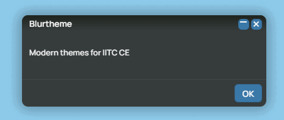
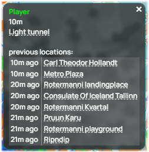
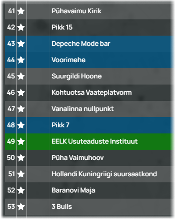
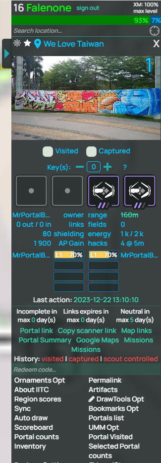
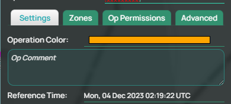
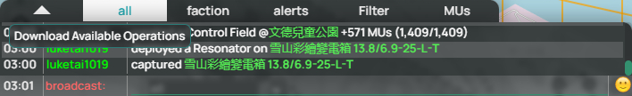

<h1 align="center">Blurtheme</h1>
 
  
  
 A set of modern looking themes for [IITC CE](https://iitc.app) and many of it's plugins
 

 
 

## What does it look like?

|    |  |
| ------------- | ------------- |

## Installation

Have [IITC CE](https://iitc.app) installed in [Tampermonkey](https://chrome.google.com/webstore/detail/tampermonkey/dhdgffkkebhmkfjojejmpbldmpobfkfo?hl=en) or similar userscript manager.

[<h3>Click here to install the the plugin</h3>]([https://github.com/Falenone/Blurtheme/raw/main/blurtheme-dark-iitc-standalone.user.js](https://github.com/Falenone/Blurtheme/raw/main/IITC-plugin-Blurtheme.user.js))

## Usage
Install the plugin, then go to [Ingress intel](https://intel.ingress.com) and on the sidebar where all the plugin options are, you'll find Themes, click it and pick a theme

## Roadmap

Light colored theme 
Various color options to choose from 

## Supported plugins

A lot of commonly available plugins have been touched up. Contact me if a plugin you use needs to be themed
## Contact and bug reports

**Falenone** in Telegram or here through Github

(<a href="#top">back to top</a>)

