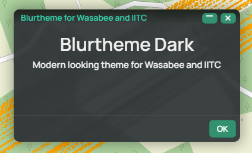

<h1 align="center">Blurtheme Dark</h1>
 
  
  
 A modern dark theme for [Wasabee](https://wasabee.rocks) and [IITC CE](https://iitc.app) powered by Wasabee's theme engine that supports a lot of popular IITC scripts
 

 
 

## What does it look like?

|    |  |
| ------------- | ------------- |

## Installation

Have [IITC CE](https://iitc.app) and [Wasabee](https://wasabee.rocks) installed in [Tampermonkey](https://chrome.google.com/webstore/detail/tampermonkey/dhdgffkkebhmkfjojejmpbldmpobfkfo?hl=en) or similar userscript manager. Or just IITC and use standalone, without wasabee.

[<h3>Click here to install the IITC standalone theme (No need of Wasabee)</h3>](https://github.com/Falenone/Blurtheme/raw/main/blurtheme-dark-iitc-standalone.user.js)

[<h3>Click here to install the IITC theme, powered by Wasabee</h3>](https://github.com/Falenone/Blurtheme/raw/main/blurtheme-dark-iitc-skin.user.js)

[<h3>Click here to install the Wasabee theme, powered by Wasabee</h3>](https://github.com/Falenone/Blurtheme/raw/main/blurtheme-dark-wasabee-skin.user.js)

## Usage
For maximum effect, install both Wasabee and IITC theme and enable both.  
Install and enable Standalone in your userscript manager, that's all. Do not have both Standalone and powered by wasabee versions installed, only one or the other.

For Wasabee versions install and enable in userscript manager:
Go to Wasabee settings (**The Bee**) and click settings (**The cog at the bottom**) Then go to **Configure skins** and drag the themes to the left box.

## Roadmap

Make a light colored theme 

## Supported plugins

Some plugins needed extra toutchup to keep the consistency of colors and such, like:  

- Bannergress
- Player Inventory
- Portal Multi Export
- Portal History support
- Scale bar
- Bookmarks
- Portal visited
- Scoreboard
- Link prolongation
- Live inventory
- Dialog list
- Draw tools
- Portal list
- Keys
- Uniques
- Emoji chat
- Offle
- Inventory
- Last action
- Player tracker add-on
- Favorite portal details
- Load more comms history
- Portal list
- Portalcounts

## Contact and bug reports

**Falenone** in Telegram or here through Github

(<a href="#top">back to top</a>)

